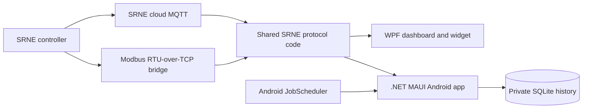
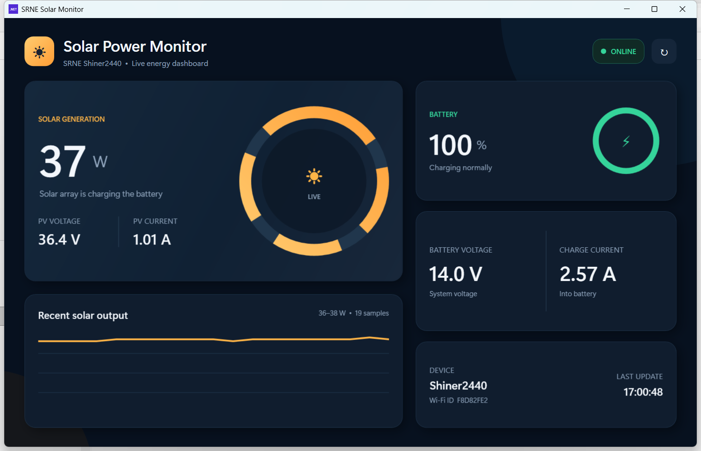
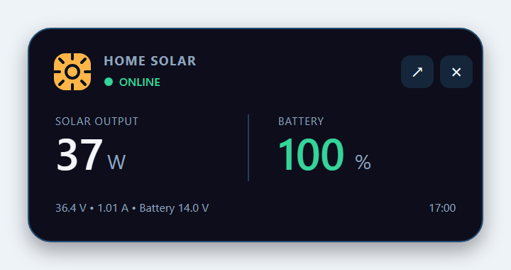

# SRNE Solar Monitor

A Windows and Android monitoring suite for SRNE Shiner-series MPPT solar
charge controllers. The repository contains a WPF desktop dashboard, an
always-on-top Windows widget, and a production-signed .NET MAUI Android app.

Both applications display live:

- Solar-panel power, voltage, and current
- Battery state of charge, voltage, and charging current
- Connection status and last update time
- Recent solar-output history

The Windows app also provides a compact, draggable desktop widget. The Android
app adds encrypted device configuration, SQLite history, and optional
background collection.

The default connection uses the SRNE cloud MQTT telemetry feed. A direct
Modbus RTU-over-TCP mode is also available for compatible Wi-Fi/serial bridges.

## Projects

| Project | Technology | Purpose |
| --- | --- | --- |
| `SolarPowerMonitor.csproj` | .NET 9 WPF | Windows dashboard and widget |
| `mobile/SolarPowerMonitor.Mobile/SolarPowerMonitor.Mobile.csproj` | .NET 10 MAUI | Android dashboard, history, settings, and background collection |
| `SolarPowerMonitor.sln` | Visual Studio solution | Opens and builds both projects together |

## Architecture



`SrneCloudClient.cs` and `ModbusRtuTcpClient.cs` are compiled into both
applications, keeping register parsing and transport behavior consistent.

## Screenshots

### Full dashboard



### Desktop widget



## Requirements

### To build the project

- Windows 10 or Windows 11
- [.NET 9 SDK](https://dotnet.microsoft.com/download/dotnet/9.0) for WPF
- .NET 10 SDK with the MAUI Android workload for Android
- Microsoft OpenJDK 21
- An SRNE-compatible Wi-Fi module and controller
- Internet access when using SRNE cloud mode

### To run a published copy

- Windows: Windows 10/11 and the
  [.NET 9 Desktop Runtime, Windows x64](https://dotnet.microsoft.com/download/dotnet/9.0)
- Android: Android 13 / API 33 or newer

## Get the source

```powershell
git clone https://github.com/mustafa-noman/SRNE-Solar-Monitor.git
cd SRNE-Solar-Monitor
```

Open `SolarPowerMonitor.sln` in Visual Studio to load both the WPF and MAUI
projects. To list them from the command line:

```powershell
dotnet sln .\SolarPowerMonitor.sln list
```

## Android MAUI application

The Android application is located under `mobile/SolarPowerMonitor.Mobile` and
uses the shared SRNE cloud and Modbus protocol implementations from the root
project.

### Android capabilities

- Dashboard for solar power, PV voltage/current, battery state of charge,
  battery voltage, and charge current
- Live session graph and refresh control
- Persisted History screen showing the latest 500 SQLite readings
- SRNE Cloud, Direct LAN, and Demo data-source modes
- Device ID protected by Android Keystore-backed secure storage
- Settings and telemetry stored in the app-private SQLite database
  `solar-monitor.db3`
- Optional Android background collection with an adjustable 1–168 hour
  interval
- Background schedule restored across device restarts

### Supported Android versions

| Setting | Value |
| --- | --- |
| Minimum Android version | Android 13 / API 33 |
| Target API | API 36 |
| Application ID | `com.mustafanoman.solarmonitor` |
| Display version | `1.0` |
| Android version code | `4` |

### Build the Android app

Install the MAUI Android workload once:

```powershell
dotnet workload install maui-android
```

Build a development APK:

```powershell
.\mobile\build-android.ps1 -Configuration Debug
```

The script uses the repository-local, ignored `.tools/android-sdk` directory
and installs missing Android SDK components when necessary.

### Create the production signing key

Run this once on the release machine:

```powershell
.\mobile\initialize-signing.ps1
```

The script creates these files outside the repository:

```text
%USERPROFILE%\.android\solar-monitor\solar-monitor-release.keystore
%USERPROFILE%\.android\solar-monitor\signing-password.txt
```

Back up both files securely. Android requires the same signing key for every
future update; losing it prevents updates to existing installations.

### Build and distribute the release APK

```powershell
.\mobile\build-android.ps1 -Configuration Release
```

Signed output:

```text
mobile\SolarPowerMonitor.Mobile\bin\Release\net10.0-android\publish\com.mustafanoman.solarmonitor-Signed.apk
```

Install or update a connected Android device:

```powershell
.\.tools\android-sdk\platform-tools\adb.exe install -r `
  .\mobile\SolarPowerMonitor.Mobile\bin\Release\net10.0-android\publish\com.mustafanoman.solarmonitor-Signed.apk
```

### Configure the Android app

1. Open **Settings**.
2. Select **SRNE Cloud**, **Direct LAN**, or **Demo**.
3. For cloud mode, enter the eight-character SRNE Wi-Fi device ID.
4. For direct mode, enter the bridge host, TCP port, and Modbus slave ID.
5. Enable or disable **Background updates** and choose a whole-hour interval
   from 1 to 168.
6. Select **Save and reconnect**.

The cloud device ID is stored using Android secure storage. MQTT broker
credentials returned by SRNE are retained only in process memory.

### SQLite history and background collection

The private SQLite database contains:

| Table | Stored data |
| --- | --- |
| `settings` | Connection mode, device name, direct host/port/slave, background enabled state, and interval |
| `telemetry` | Timestamp, source, foreground/background collection type, solar watts, battery percentage, PV voltage/current, and battery voltage/current |

Every successful foreground reading is logged. When background updates are
enabled, Android `JobScheduler` requests another reading at the configured
interval. Android may defer work because of Doze mode, battery optimization,
network availability, or vendor power-management rules, so the interval is
approximate rather than an exact alarm. The database currently has no
automatic retention limit; the History screen displays only the newest 500
rows.

### Telemetry register mapping

The cloud and direct modes use holding registers starting at `0x0100`:

| Measurement | Register index | Scale |
| --- | ---: | ---: |
| Battery state of charge | `0` | raw percent |
| Battery voltage | `1` | ÷ 10 V |
| Battery charging current | `2` | ÷ 100 A |
| PV array voltage | `7` | ÷ 10 V |
| PV array current | `8` | ÷ 100 A |
| PV charging power | `9` | raw watts |

## Configure the Windows application

Find the eight-character Wi-Fi device ID in the SRNE mobile app under:

```text
Device → Basic Info → Device ID
```

Run the full dashboard with your device ID:

```powershell
dotnet run --project .\SolarPowerMonitor.csproj -- --device-id YOUR_DEVICE_ID
```

Example:

```powershell
dotnet run --project .\SolarPowerMonitor.csproj -- --device-id A1B2C3D4
```

The device ID must contain exactly eight hexadecimal characters.

You can also set it permanently for your Windows account:

```powershell
[Environment]::SetEnvironmentVariable(
    "SOLAR_DEVICE_ID",
    "YOUR_DEVICE_ID",
    "User"
)
```

Sign out and back in after setting the environment variable.

## Run the application

Full dashboard:

```powershell
dotnet run --project .\SolarPowerMonitor.csproj
```

Compact always-on-top widget:

```powershell
dotnet run --project .\SolarPowerMonitor.csproj -- --widget
```

The widget can be dragged around the screen. Select the arrow button to open
the full dashboard.

## Publish for another Windows PC

From the project folder, create a framework-dependent Windows deployment:

```powershell
dotnet publish .\SolarPowerMonitor.csproj -c Release --no-self-contained `
  -p:UseAppHost=false `
  -o ".\SolarMonitor-Publish"
```

Copy the complete `SolarMonitor-Publish` folder to the destination PC. Do not
copy only `SolarPowerMonitor.dll`.

For example, copy it to:

```text
E:\App\SolarMonitor-Publish
```

Install the .NET 9 Desktop Runtime x64 on the destination PC before launching
the application.

## Create a full-dashboard desktop shortcut

Open PowerShell on the destination PC and run:

```powershell
$folder = "E:\App\SolarMonitor-Publish"
$desktop = [Environment]::GetFolderPath("Desktop")
$shell = New-Object -ComObject WScript.Shell
$link = $shell.CreateShortcut("$desktop\Solar Power Monitor.lnk")

$link.TargetPath = "C:\Program Files\dotnet\dotnet.exe"
$link.Arguments = "`"$folder\SolarPowerMonitor.dll`""
$link.WorkingDirectory = $folder
$link.Save()
```

## Create a widget without a console window

Launching a managed DLL directly through `dotnet.exe` may display a blank
console window. The following hidden launcher prevents that.

Create `StartWidget.vbs`:

```powershell
$folder = "E:\App\SolarMonitor-Publish"
$launcher = "$folder\StartWidget.vbs"

@'
Set shell = CreateObject("WScript.Shell")
shell.Run """C:\Program Files\dotnet\dotnet.exe"" ""E:\App\SolarMonitor-Publish\SolarPowerMonitor.dll"" --widget", 0, False
'@ | Set-Content -LiteralPath $launcher
```

Create desktop and automatic-startup shortcuts:

```powershell
$folder = "E:\App\SolarMonitor-Publish"
$launcher = "$folder\StartWidget.vbs"
$desktop = [Environment]::GetFolderPath("Desktop")
$startup = [Environment]::GetFolderPath("Startup")
$shell = New-Object -ComObject WScript.Shell

foreach ($path in @(
    "$desktop\Solar Power Widget.lnk",
    "$startup\Solar Power Widget.lnk"
)) {
    $link = $shell.CreateShortcut($path)
    $link.TargetPath = "C:\Windows\System32\wscript.exe"
    $link.Arguments = "`"$launcher`""
    $link.WorkingDirectory = $folder
    $link.Save()
}
```

The widget will start automatically the next time the user signs into
Windows.

To disable automatic startup, press `Win + R`, enter `shell:startup`, and
delete the `Solar Power Widget` shortcut.

## Smart App Control

Windows Smart App Control may block an unsigned
`SolarPowerMonitor.exe`. This repository therefore disables the generated
native app host and launches the managed DLL through Microsoft's signed
`dotnet.exe`.

Recommended command:

```powershell
dotnet SolarPowerMonitor.dll
```

Do not disable Windows security features just to run this application. A
publicly distributed native executable should be signed with a trusted
code-signing certificate.

## Direct connection mode

For a transparent Modbus TCP/serial bridge:

```powershell
dotnet run --project .\SolarPowerMonitor.csproj -- `
  --source direct `
  --host 192.168.10.167 `
  --port 8899 `
  --slave 255
```

The bridge must use serial settings compatible with the controller. The
application sends complete Modbus RTU request frames and expects complete RTU
response frames.

## Command-line options

| Option | Purpose | Default |
| --- | --- | --- |
| `--widget` | Open the compact desktop widget | Disabled |
| `--source` | Select `cloud` or `direct` mode | `cloud` |
| `--device-id` | Eight-character SRNE Wi-Fi device ID | `SOLAR_DEVICE_ID` |
| `--host` | Direct bridge IP address or hostname | `192.168.10.167` |
| `--port` | Direct bridge TCP port | `8899` |
| `--slave` | Modbus slave address | `255` |
| `--poll-ms` | Direct-mode polling interval | `2000` |
| `--connect-timeout-ms` | Connection timeout | `5000` |
| `--response-timeout-ms` | Telemetry timeout | `15000` |
| `--reconnect-delay-ms` | Delay before reconnecting | `2000` |
| `--self-test` | Run protocol tests and exit | Disabled |

Equivalent environment variables use the `SOLAR_` prefix, including:

- `SOLAR_DEVICE_ID`
- `SOLAR_SOURCE`
- `SOLAR_HOST`
- `SOLAR_PORT`
- `SOLAR_SLAVE_ID`

## Protocol verification

Run the offline protocol tests:

```powershell
dotnet run --project .\SolarPowerMonitor.csproj -- --self-test
```

The tests verify:

- Modbus request bytes and CRC-16
- Register parsing and scale factors
- Rejection of corrupted responses

No physical controller is required for these tests.

## Security and privacy

- No SRNE MQTT username or password is stored in this repository.
- MQTT connection details are requested from the SRNE service at runtime.
- The Android device ID is stored with Android Keystore-backed secure storage.
- Android settings and telemetry remain in the app-private SQLite database.
- Android cleartext traffic is disabled globally and allowed only for
  `www.srne.net`, because the vendor configuration endpoint currently uses
  HTTP. MQTT transport security remains dependent on the configuration
  returned by SRNE.
- Production signing keys and passwords are stored outside the repository.
- Do not commit account passwords, tokens, private certificates, or diagnostic
  output containing credentials.
- Treat the eight-character device ID as private hardware identity data and do
  not include a real value in source code, documentation, screenshots, or bug
  reports.

## AI use

This project was developed with assistance from
[OpenAI Codex](https://openai.com/codex/). Codex was used for implementation,
debugging, UI development, protocol testing, and documentation. Project
direction, device configuration, testing decisions, and repository ownership
remain with Mustafa Noman.

## Troubleshooting

### The shortcut does nothing

Confirm that this file exists:

```text
C:\Program Files\dotnet\dotnet.exe
```

If it does not, install the .NET 9 Desktop Runtime x64.

### The application stays on CONNECTING

- Confirm that the computer has internet access.
- Confirm that the device is online in the SRNE mobile app.
- Check that the configured device ID is correct.
- Allow outbound HTTP and MQTT connections through the firewall.

### The Android app stays offline

- Open **Settings** and verify the selected source and device ID.
- Confirm Wi-Fi or mobile data is available.
- Confirm the SRNE device is online in the vendor app.
- For Direct LAN mode, confirm the phone can reach the bridge address and port.
- Select **Save and reconnect** after changing settings.

### Android background history is delayed

Android schedules periodic work opportunistically. Confirm that background
updates are enabled in the app, network access is available, and the device's
battery manager is not restricting Solar Monitor. The Settings screen shows
the stored reading count and last successful background timestamp.

### Smart App Control blocks the executable

Use the DLL shortcut described above instead of launching an unsigned `.exe`.

### The widget opens with a blank console

Use the `StartWidget.vbs` hidden launcher and `wscript.exe` shortcut described
above.

## Contributing

Issues and pull requests are welcome. Before submitting a change:

```powershell
dotnet build .\SolarPowerMonitor.sln -c Release
dotnet run --project .\SolarPowerMonitor.csproj -c Release --no-build -- --self-test
.\mobile\build-android.ps1 -Configuration Debug
```

Please avoid including real credentials or private device information in bug
reports.
